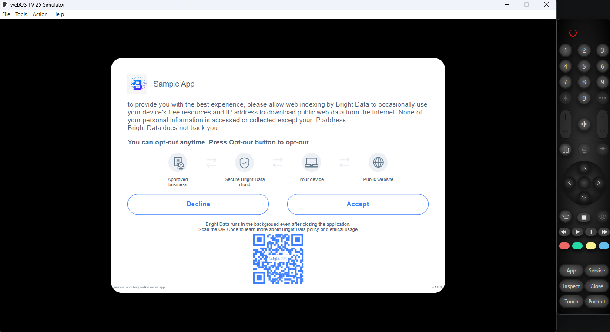
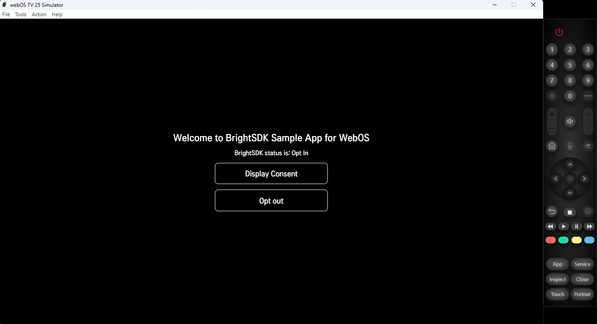

# BrightSDK — WebOS Integration Example

This folder demonstrates how to integrate BrightSDK into a WebOS TV app using the **bright-sdk-integration** CLI tool.


## Folder structure

```
webos/
├── app/                        ← WebOS web app source
│   ├── appinfo.json            ← LG app manifest
│   ├── index.html              ← main HTML with BrightSDK init
│   ├── icon.png
│   ├── largeIcon.png
│   └── webOSTVjs-1.2.10/       ← WebOS TV JS library
├── brd_sdk.config.json         ← SDK config (workdir, version, CDN URL)
├── package.json                ← npm scripts for update/reset
├── assets/                     ← screenshots
└── README.md                   ← this file
```

## Prerequisites

- **Node.js ≥ 18** — to run the integration tool
- **WebOS SDK / CLI** — to package and deploy to a TV or emulator
- A **BrightSDK API key** exported as `SDK_API_KEY` — see [How to get a key](https://brightsdk.github.io/bright-sdk-downloader-rs/obtain-api-key.html)
- An internet connection — the SDK zip is downloaded from the CDN on first run

## API key

The integration tool requires a **BrightSDK API key** passed via the `SDK_API_KEY` environment variable.

**macOS / Linux:**
```sh
export SDK_API_KEY=<your-api-key>
```

**Windows (PowerShell):**
```powershell
$env:SDK_API_KEY = "<your-api-key>"
```

**Windows (CMD):**
```cmd
set SDK_API_KEY=<your-api-key>
```

**How to get a key:**

1. Log in at [bright-sdk.com](https://bright-sdk.com)
2. Go to **Settings → Company profile → API keys**
3. Copy an existing key or generate a new one

> Full step-by-step guide with screenshots:\
> <https://brightsdk.github.io/bright-sdk-downloader-rs/obtain-api-key.html>

## Quick start

### 1. Clone and run

```sh
git clone https://github.com/BrightSDK/bright-sdk-integration-example-webos.git
cd bright-sdk-integration-example-webos
npm start
```

This launches an interactive menu where you can install/update the SDK, reset, or view the README.

The tool will:

1. Download the latest BrightSDK zip from `cdn.bright-sdk.com/static/`
2. Extract `brd_api.js` and `brd_api.helper.js` into `app/`
3. Extract the `service/` directory for the background service
4. Inject SDK script tags into `app/index.html`
5. Save `brd_sdk.config.json` for future runs

### 2. Package and run

Use the WebOS CLI to package and install:

```sh
ares-package app service
ares-install com.brightsdk.sample.app_1.0.0_all.ipk
ares-launch com.brightsdk.sample.app
```

Or use the WebOS IDE to open and run the project.

### 3. What the app shows

- On first launch, the SDK consent dialog is displayed automatically
- A status label reflecting the current SDK consent state (N/A, Opt In, Opt Out)
- **Display Consent** — calls `BrightSDK.showConsent()`
- **Opt out / Opt in** — toggles between `BrightSDK.disable()` and `BrightSDK.enable(true)`

### Screenshots

|           Consent dialog           |         Main screen          |
| :--------------------------------: | :--------------------------: |
|  |  |

## Using the tool with your own project

Copy `brd_sdk.config.json` next to your own app directory, then edit it:

```json
{
    "workdir": ".",
    "app_dir": "app",
    "libs_dir": "app",
    "index": "app/index.html",
    "sdk_service_dir": "service",
    "sdk_ver": "latest",
    "use_helper": true
}
```

| Key               | Description                                                         |
| ----------------- | ------------------------------------------------------------------- |
| `workdir`         | Working directory for the tool.                                     |
| `app_dir`         | Directory containing your web app files.                            |
| `libs_dir`        | Directory where `brd_api.js` will be placed.                        |
| `index`           | Path to `index.html` — SDK script tags are injected here.           |
| `sdk_service_dir` | Directory for the background service.                               |
| `sdk_ver`         | `"latest"` or a specific version string.                            |
| `use_helper`      | Whether to include `brd_api.helper.js` (recommended).               |

Then run:

```sh
npm start
```

This opens an interactive menu with all available actions (install, update, reset, view README).
